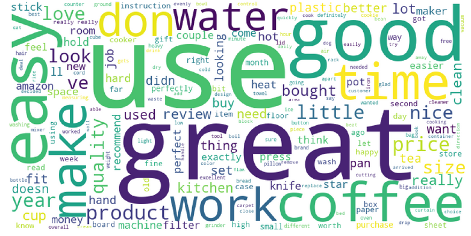
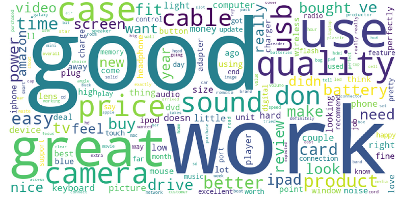

# Insights From Reviews
We're trying to extract actionable information from the reviews (like product features that are liked, disliked or missing). 
The word clouds below prove that such information is not available by the count based methods. 

## The presentation provides more details of the project
https://docs.google.com/presentation/d/1E97AgDOd7hyuDw1DYvUUuBT34waVcrkkE55XwsYoQAc/edit#slide=id.g5e3cd57fe6_0_6

## Inside the reviews for Home and Kitchen products from Amazon

## Inside the reviews for Electronics

